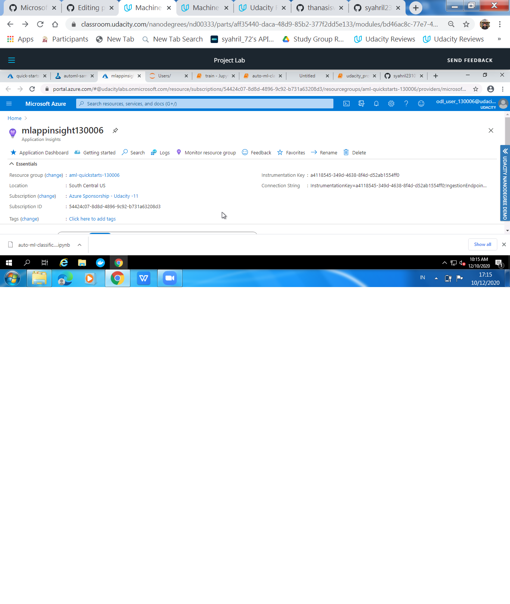

## DIABETES PROJECT

## Overview
On this project, I have used the Diabetes dataset from Kaggle to predict the possibility of a patient to have a diabetes based on his/her medical records. The objective of the dataset is to diagnostically predict whether or not a patient has diabetes, based on certain diagnostic measurements included in the dataset. Several constraints were placed on the selection of these instances from a larger database. The datasets consists of several medical predictor variables and one target variable, Outcome. Predictor variables includes the number of pregnancies the patient has had, their BMI, insulin level, age, and so on. This is a classification problem. I have used two different train methods to achieve the best score. One training method is using the hyperdrive to optimize the hyperparameters of the logistic regression model for the heart failure dataset. The second training method was the utilization of the azure automl to find the best model fit for the diabetes dataset.

Hyperdrive Model -> hyperparameter_tuning.ipynb
AutoML Model -> automl.ipynb
Finally, the best obtained model from the above two training methods is deployed using a webservice in the Azure ML studio.

## Project Set Up and Installation

This project requires access into the Azure ML studio. The following steps to be followed to initialize the project:
 
1. Create a new compute target in the Azure ML studio and run the above notebooks using jupyter notebooks.

2. Upload dataset from Github Repo that previouly download from Kaggle.

## Dataset
## Overview
Diabetes dataset was obtained from the Kaggle website. https://www.kaggle.com/uciml/pima-indians-diabetes-database. The dataset is also attached (Diabetes.csv)

There are 8 features as clinical records of the patients and the prediction is on the Outcome column.
Task
All of the eight features are used from this dataset. The Outcome is the prediction for our classification problem.

For the hyperdrive, I have used the SKLEARN logistic regression algorithm to predict the Outcome column using the Diabetes dataset.
From the automl run becomes apparent that the best fitted model is the Voting Ensemble model.
Access
I have downloaded the dataset from the Kaggle website. Then, I upload to github, and then access it to the model.
In the notebook, I have used the following command to import the dataset into my workspace: 
url = "https://github.com/syahril231072/foree/raw/main/Diabetes.csv"
data = pd.read_csv(url, sep=',', header=0, encoding= 'unicode_escape')

## Hyperparameter Tuning

For that training model, I used logistic regression because the task for the machine learning algorithm was to solve a classification problem. For that reason, I used the SKLEARN logistic regression model to predict the Outcome. I tried to optimize the "C" and "max_iter" parameters of the logistic regression algorithm. The C parameter represents the inverse regularization strenght and the max_iter parameter represents the maximum number of iterations for the solvers to converge. The "C" parameter was a selection of numbers in uniform from 0.2, 0,5 to 1. For the "max_iter" parameter was a choise from the following number of iterations (25, 50, 100). I have used a random selection of these both parameters for the optimization of the logistic regression model. Finally, the banditPolicy is used as a termination policy which every two iterations checks if the primary metric which is the accuracy falls outside the top 10% range

Results
The logistic regression model achieved an accuracy of 0.779. The parameters of achieving that accuracy was "C":0.5 and "max_iter": 50 as shown in the picture below:

Screenshot of the best model is shown below:

Screenshot of the RunDetails is shown below:

## Automated ML
The most important settings for the automl run are the following:
1. The task is classification.
2. The prediction label is set as Outcome.
3. The primary metric is AUC_weighted.
4. Experiment timeouts after 0,3 jam (18 menit).
5. featurization is set to auto.
6. max_concurrent_iterations = 4
7. max_cores_per_iteration = -1
8. enable_early_stopping is set to True
## Results
The voting Ensemble algorithm is the best fitted model with accuracy 84.5%. The parameters of the automl are detailed in the previous section and also shown below:

One of the impovements will be to collect more data for this classification problem. Also, it might be worthy to test the automl using deep learing models as well to see if the accuracy is increased.

Screenshots of the RunDetails are shown below:

Screenshot of the best model is shown below:

## Model Deployment
The model with the best accuracy is the voting Ensemble model from the automl run. Initially, I View updated featurization summary. Then, I Retrieve the Best Model's explanation, Retrieve the Best ONNX Model, and Save the best ONNX model. Then, I Predict with the ONNX model, using onnxruntime package and Deploy the model as a Web Service on Azure Container Instance. Finally, the webservice was tested. As it can be seen in the notebook, I used the json command in order to send the data in the webservice. A sample input is the first four rows of the test data. At the end of the automl notebook, I have tested the output of the endpoint.
Screenshot is shown the webservice is successfully deployed:

Screenshot is shown the response from my webservice:

Screeshot is shown the active endpoint for the deployed model/It can be seen that the endpoint for the saved model is Healthy and active:

## Screen Recording
Screen recording is uploaded in the following link: https://www.youtube.com/watch?v=yFtDKdllxsM
## Standout Suggestions
1. As mentioned above, I deployed the webservice using onnx. 
2. I also have enabled the application insights which it can be seen the successful requests from the file I attached (auto-mlenableappinsight.ipynb) and responses of my model. see screenshot below:

## Improvements for my model is as such:

1. Collect more data in order to make the model more accurate
2. Deploy my model to the Edge using Azure IoT Edge
